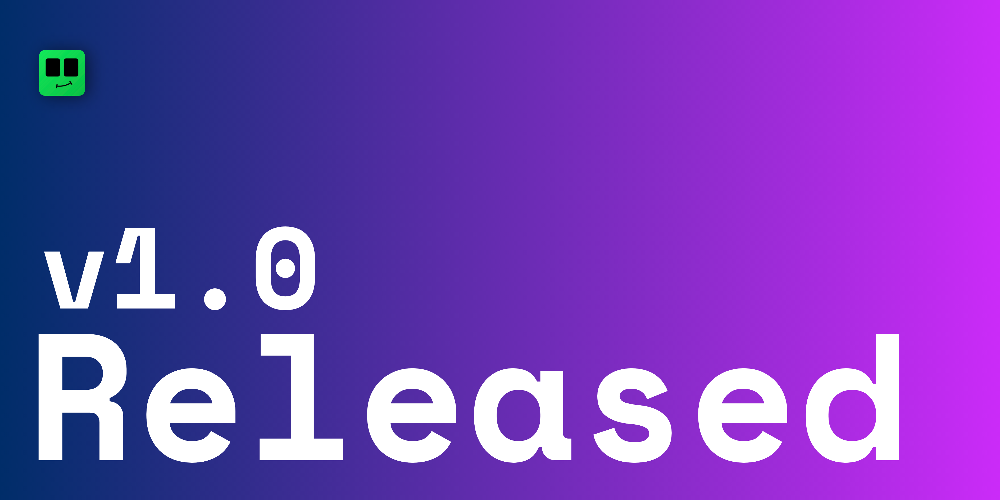

We are very excited to announce that we are releasing v1.0 of our bintoo project, we have work tirelessly for the past couple of months, and i think it is the right time to announce bintoo, still bintoo is not finished, it will have constant updates, with lot of features added in future as we progress to make bintoo one of the best free local hosting server for minecraft.

As for the latest build, you can download it in windows and linux for now, (we will add macos if we get the demand for it), if you found any bug, want some features or have some questions, feel free to ask us out at [discord server](https://discord.gg/eGWSxbnXrh).

For documentation on how to use bintoo will be on our [docs](/docs/intro) or you can visit our [youtube channel](https://www.youtube.com/@bintoo_xyz) for video guide

Hope you create amazing server and have fun with your friends.

Keep Crafting :)
