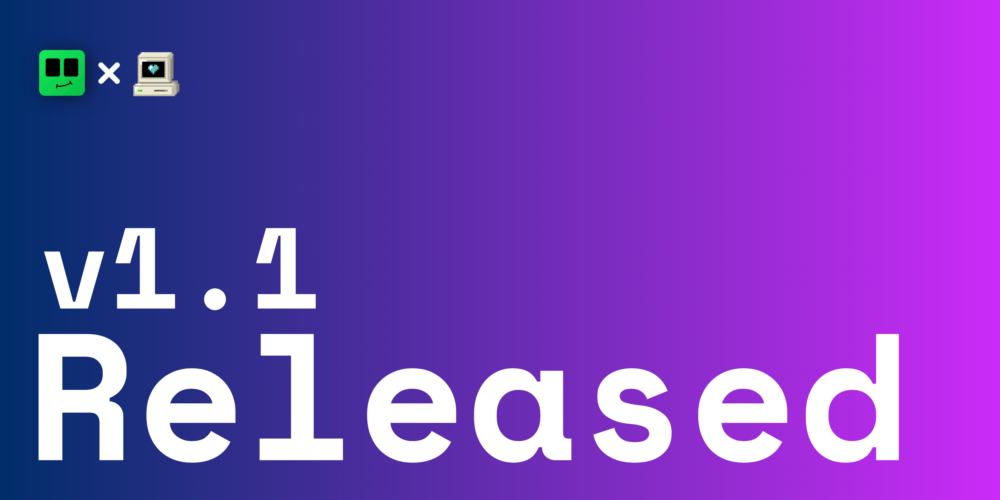

We are happy to announce a new update for Bintoo!

With v1.1, Playit integration is now built into Bintoo. You can now share your Minecraft server with your friends without the hassle of port forwarding. Simply connect your Playit account, start your server, and you're ready to play.

As always, we're continuing to improve Bintoo with more features and updates. If you find any bugs or have ideas for future features, feel free to join our [Discord server](https://discord.gg/eGWSxbnXrh) and let us know.

Thank you for supporting Bintoo.

Keep Crafting :)
